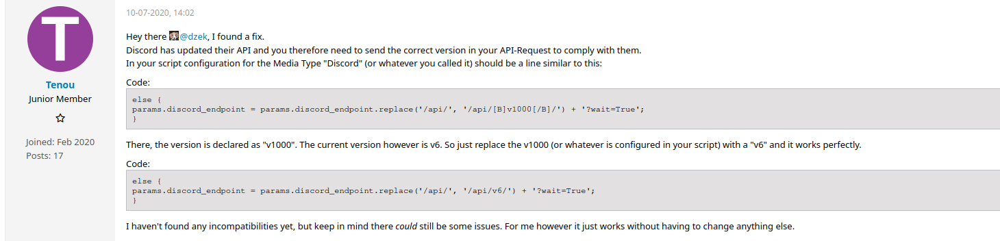
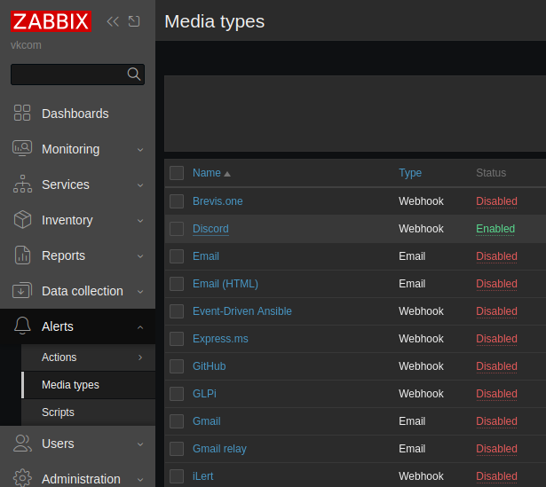
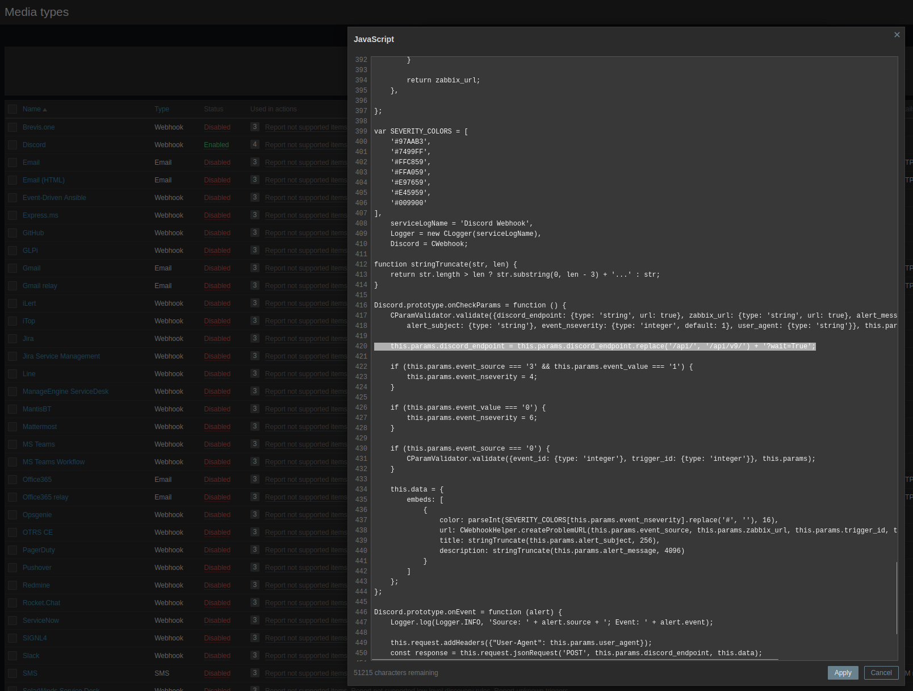

# Zabbix setup for basic monitoring
For more information please read and guide from https://www.zabbix.com/download?zabbix=7.0&os_distribution=debian&os_version=12&components=server_frontend_agent&db=pgsql&ws=nginx
---

##### 1. First you'd want to set up basic auth with ssh keys.

`sed -i 's/^#\?Port 22$/Port 56654/' /etc/ssh/sshd_config`
This will also change the ssh port.

##### 2. Add your keys to ~/.ssh/authorized_keys

`touch ~/.ssh/authorized_keys && chmod 0600 ~/.ssh/authorized_keys && echo "ssh-ed25519 <YOURDATA>" >> ~/.ssh/authorized_keys`

##### 3. Apply ssh changes

`systemctl daemon-reload && systemctl restart ssh.socket && systemctl restart ssh.service`

##### 4. Setup ufw and fail2ban
For more information: https://www.bennetrichter.de/en/tutorials/ssh-server-fail2ban-linux/

`apt update && apt install ufw`

```
ufw status
ufw allow from <YOUR_IP> proto tcp to any port 8080 comment 'zabbix web access'
ufw allow from <YOUR_IP> proto tcp to any port <SERVER_SSH_PORT> comment 'ssh port'
ufw allow from <VMANGOS_PROD_IP> to any port 10050 comment 'zabbix agent vmangos-prod'
ufw allow from <VMANGOS_PROD_IP> to any port 10051 comment 'zabbix agent vmangos-prod'
ufw enable
```
`apt-get install fail2ban -y && systemctl enable --now fail2ban`

##### 5. Install zabbix server and dependencies
(This is my setup for Debian, for other linux distributions it might be slightly different)

```
wget https://repo.zabbix.com/zabbix/7.0/debian/pool/main/z/zabbix-release/zabbix-release_latest_7.0+debian12_all.deb
dpkg -i zabbix-release_latest_7.0+debian12_all.deb
apt update
apt install zabbix-server-pgsql zabbix-frontend-php php8.2-pgsql zabbix-nginx-conf zabbix-sql-scripts zabbix-agent postgresql postgresql-contrib mc
systemctl status postgresql
systemctl start postgresql
systemctl enable postgresql
```

##### 6. Create initial database

```
sudo -i -u postgres
sudo -u postgres createuser --pwprompt zabbix
sudo -u postgres createdb -O zabbix zabbix
zcat /usr/share/zabbix-sql-scripts/postgresql/server.sql.gz | sudo -u zabbix psql zabbix
```

##### 7. Configure the database for Zabbix server
Edit file /etc/zabbix/zabbix_server.conf
DBPassword=<YOUR_PASSWORD>

```
mcedit /etc/zabbix/zabbix_server.conf
```

##### 8. Configure the database for Zabbix server
Edit file /etc/zabbix/nginx.conf uncomment and set 'listen' and 'server_name' directives.

```
mcedit /etc/zabbix/nginx.conf
```

##### 9. Start Zabbix server and agent processes

```
systemctl restart zabbix-server zabbix-agent nginx php8.2-fpm
systemctl enable zabbix-server zabbix-agent nginx php8.2-fpm
```

##### 10. Open Zabbix UI web page

The URL for Zabbix UI when using Nginx depends on the configuration changes you should have made. 
http://<ZABBIX_IP>:8080/zabbix.php?

##### 11. For sending alerts to discord

https://www.zabbix.com/ru/integrations/discord
https://www.youtube.com/watch?v=cqnHWhDt8Ec

##### 12. You may also want to fix the discord template bug

set there a correct (current i guess) discord api version

https://www.zabbix.com/forum/in-russian/404893-discord-api







##### 13. Setup zabbix agent on prod server

In my case i setup this on Ubuntu server, you can pick whatever you like
For more information please read and guide from https://www.zabbix.com/download?zabbix=7.0&os_distribution=ubuntu&os_version=24.04&components=agent&db=&ws=

```
wget https://repo.zabbix.com/zabbix/7.0/ubuntu/pool/main/z/zabbix-release/zabbix-release_latest_7.0+ubuntu24.04_all.deb
dpkg -i zabbix-release_latest_7.0+ubuntu24.04_all.deb
apt update
apt install zabbix-agent
systemctl restart zabbix-agent
systemctl enable zabbix-agent

mcedit /etc/zabbix/zabbix_agentd.conf

Server=<ZABBIX_SERVER_IP>
ServerActive=<ZABBIX_SERVER_IP>

systemctl restart zabbix-agent
```

##### 14. Add your server into zabbix-server monitoring

https://www.zabbix.com/documentation/current/en/manual/config/hosts/host