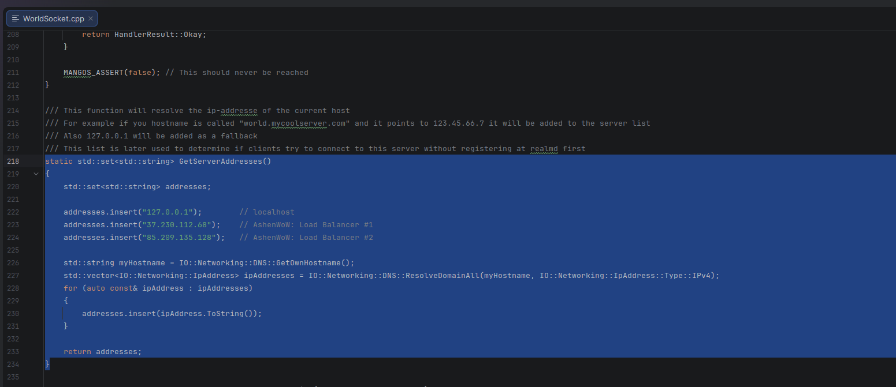

# Haproxy balancer for alternative enter points in to a server (if server unavailable due to some region restrictions)
For more information please read https://www.haproxy.com/blog/haproxy-configuration-basics-load-balance-your-servers
And https://www.haproxy.com/blog/introduction-to-haproxy-logging

# In order to get in work we must modify the core and add balancer(s) ip addresses
https://github.com/Wall-core/AshenWoW/commit/a85e82f2ae550a95d5438c090f5a32fa09af887b

---

##### 1. First you'd want to set up basic auth with ssh keys.

`sed -i 's/^#\?Port 22$/Port 56654/' /etc/ssh/sshd_config`
This will also change the ssh port.

##### 2. Add your keys to ~/.ssh/authorized_keys

`touch ~/.ssh/authorized_keys && chmod 0600 ~/.ssh/authorized_keys && echo "ssh-ed25519 <YOURDATA>" >> ~/.ssh/authorized_keys`

##### 3. Apply ssh changes

`systemctl daemon-reload && systemctl restart ssh.socket && systemctl restart ssh.service`

##### 4. Setup ufw and fail2ban
For more information: https://www.bennetrichter.de/en/tutorials/ssh-server-fail2ban-linux/

`apt update && apt install ufw -y`

```
ufw status
ufw allow from <YOUR_IP> proto tcp to any port <SERVER_SSH_PORT> comment 'ssh port access'
ufw allow 443 comment 'website https'
ufw allow 80 comment 'website http'
ufw allow 8085 comment 'WoW port 1'
ufw allow 3724 comment 'WoW port 2'
ufw enable
```
`apt-get install fail2ban -y && systemctl enable --now fail2ban`

##### 5. Install haproxy server and dependencies

```
apt update & apt install haproxy rsyslog -y
```

##### 6. Edit haproxy config
An example of a haproxy config

```
mcedit /etc/haproxy/haproxy.cfg
```

```
after edit do:
systemctl daemon-reload
systemctl start haproxy
```

```
global
	log /dev/log	local0
	log /dev/log	local1 notice
	chroot /var/lib/haproxy
	stats socket /run/haproxy/admin.sock mode 660 level admin
	stats timeout 30s
	user haproxy
	group haproxy
	daemon

	# Default SSL material locations
	ca-base /etc/ssl/certs
	crt-base /etc/ssl/private

	# See: https://ssl-config.mozilla.org/#server=haproxy&server-version=2.0.3&config=intermediate
        ssl-default-bind-ciphers ECDHE-ECDSA-AES128-GCM-SHA256:ECDHE-RSA-AES128-GCM-SHA256:ECDHE-ECDSA-AES256-GCM-SHA384:ECDHE-RSA-AES256-GCM-SHA384:ECDHE-ECDSA-CHACHA20-POLY1305:ECDHE-RSA-CHACHA20-POLY1305:DHE-RSA-AES128-GCM-SHA256:DHE-RSA-AES256-GCM-SHA384
        ssl-default-bind-ciphersuites TLS_AES_128_GCM_SHA256:TLS_AES_256_GCM_SHA384:TLS_CHACHA20_POLY1305_SHA256
        ssl-default-bind-options ssl-min-ver TLSv1.2 no-tls-tickets

defaults
	log	global
#	mode	http
#	option	httplog
	mode tcp
	option tcplog
	option	dontlognull
        timeout connect 5000
        timeout client  50000
        timeout server  50000
	errorfile 400 /etc/haproxy/errors/400.http
	errorfile 403 /etc/haproxy/errors/403.http
	errorfile 408 /etc/haproxy/errors/408.http
	errorfile 500 /etc/haproxy/errors/500.http
	errorfile 502 /etc/haproxy/errors/502.http
	errorfile 503 /etc/haproxy/errors/503.http
	errorfile 504 /etc/haproxy/errors/504.http

frontend wow_8085_front
    mode tcp
    bind :8085
    default_backend wow_8085_back

backend wow_8085_back
    mode tcp
    balance leastconn
    server prod1 <VMANGOS_PROD_IP>:8085

frontend wow_3724_front
    mode tcp
    bind :3724
    default_backend wow_3724_back

backend wow_3724_back
    mode tcp
    balance leastconn
    server prod2 <VMANGOS_PROD_IP>:3724

```

##### 7. Edit rsyslog config
An example of a rsyslog config

```
mcedit /etc/rsyslog.conf
```

```
# /etc/rsyslog.conf configuration file for rsyslog
#
# For more information install rsyslog-doc and see
# /usr/share/doc/rsyslog-doc/html/configuration/index.html
#
# Default logging rules can be found in /etc/rsyslog.d/50-default.conf


#################
#### MODULES ####
#################

module(load="imuxsock") # provides support for local system logging
#module(load="immark")  # provides --MARK-- message capability

# provides UDP syslog reception
#module(load="imudp")
#input(type="imudp" port="514")

# provides TCP syslog reception
#module(load="imtcp")
#input(type="imtcp" port="514")

# provides kernel logging support and enable non-kernel klog messages
module(load="imklog" permitnonkernelfacility="on")

###########################
#### GLOBAL DIRECTIVES ####
###########################

# Filter duplicated messages
$RepeatedMsgReduction on

#
# Set the default permissions for all log files.
#
$FileOwner syslog
$FileGroup adm
$FileCreateMode 0640
$DirCreateMode 0755
$Umask 0022
$PrivDropToUser syslog
$PrivDropToGroup syslog

#
# Where to place spool and state files
#
$WorkDirectory /var/spool/rsyslog

#
# Include all config files in /etc/rsyslog.d/
#
$IncludeConfig /etc/rsyslog.d/*.conf

# Collect log with UDP
$ModLoad imudp
$UDPServerAddress 127.0.0.1
$UDPServerRun 514

# Creating separate log files based on the severity
local0.* /var/log/haproxy-traffic.log
local0.notice /var/log/haproxy-admin.log
```